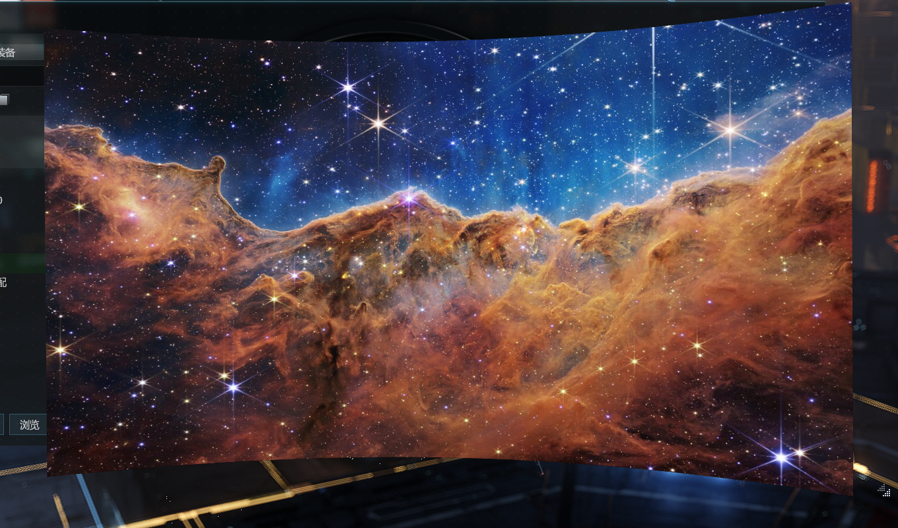

# Cyclorama Curved Screen 🛰️

**A curved screen, floating on your desktop.**

```
   ╭─╮                                            ╭─╮
   │  ╰────────────────────────────────────────╯  │
   │       ·        ✦            ·        ✦       │
   │    ✦       C Y C L O R A M A        ·        │
   │        ·          ✦         ·           ✦    │
   │  ╭────────────────────────────────────────╮  │
   ╰─╯                                            ╰─╯
        the curved backdrop scenery is thrown onto —
                     now on your desktop
```

Drop in a photo, a film, or a live web page — it plays on a concave panel that hangs there like the
viewscreen of a starship bridge. No window, no frame, no chrome. Just a curved surface, broadcasting.
It leans toward your cursor when you pass by, and drifts gently while it waits.


▶ **[Watch the full demo](media/demo.mp4)** — 40 seconds, and the demo itself is code 🎬

| 🖼️ your pictures | 🎬 your films | 🌐 anything live on the web |
|---|---|---|
|  |  |  |

## ✨ Put anything on it

```
Cyclorama                       # 🌌 a James Webb image, out of the box
Cyclorama photo.jpg             # 🖼️ your picture
Cyclorama film.mp4              # 🎬 a film — loops, floating player bar
Cyclorama https://example.com   # 🌐 a live page: a dashboard, a stream, a clock
```

Drag it anywhere · pull the corner to resize · `Esc` → gone ✨

Ships with **James Webb Space Telescope** imagery in [`samples/`](samples/) — nebulae, galaxies, the
deep field — so out of the box it looks like it's receiving something from very, very far away 📡

## 🛠️ Details

<sub>For the curious — everything technical lives here, and only here.</sub>

- **Flags** — `--curve 0.5` (bend, 0–0.8) · `--flat` · `--top` (always-on-top) · `--still` (no idle
  drift) · `--mute` · `--size WxH` · `--pos X,Y` · force a type with `--image` / `--video` / `--url`
- **How it works** — the content is painted onto a real 3D mesh bent into a parabola
  (`z = curveDepth · nx²`; flip the sign for a convex bulge) and viewed through a perspective camera.
  Images use an `ImageBrush`, video plays through a GPU `VideoDrawing`, web pages render in an
  offscreen WebView2. The whole app is two files — see [`Program.cs`](Program.cs).
- **Build** — `dotnet build -c Release` · needs .NET 8 on Windows (WebView2 runtime for web pages,
  preinstalled on current Windows 10/11)
- **The demo is code** — [`promo/`](promo/) is an HTML composition rendered to mp4 (60 fps) with
  [HyperFrames](https://github.com/heygen-com/hyperframes); `npx hyperframes render` rebuilds it
- **Credits** — Webb imagery: NASA, ESA, CSA, STScI, CC BY 4.0 ([details](samples/CREDITS.md)) ·
  code: [MIT](LICENSE)
